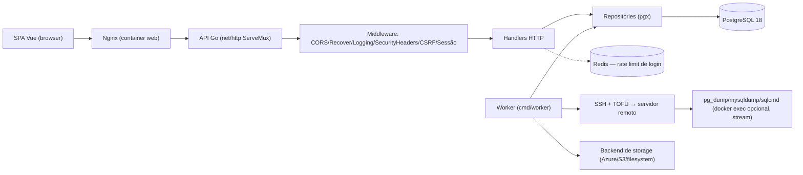
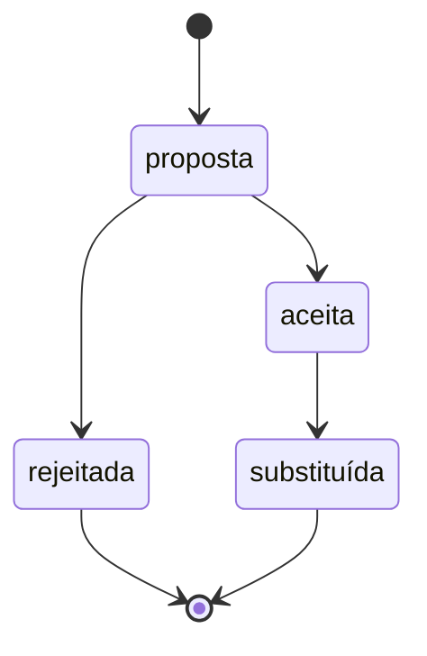

# Arquitetura — Backapeando

Companion renderizado: `docs/arquitetura.html`, gerado e mantido pela skill
`archify` a partir do conteúdo deste arquivo. Regenerar sempre que este
arquivo mudar — ver `## Regras de alteração`.

## Objetivo

Sistema web para gerenciar backups de bancos de dados (PostgreSQL, MySQL ou
SQL Server) em servidores remotos, acessados via SSH — rodando dentro de um
container Docker ou diretamente no host/instância. Backups são enviados a um
destino de armazenamento configurável (Azure Blob Storage, S3 ou compatível,
ou filesystem local/NFS), com retenção GFS (Grandfather-Father-Son) e
agendamento via expressão cron por servidor.

## Stack

- Frontend: Vue 3 + Vite + TypeScript + Tailwind CSS + shadcn-vue (parcial, `reka-ui`)
- Backend: Go 1.26, stdlib `net/http` (ServeMux com padrões de rota `MÉTODO /caminho`)
- Banco de dados: PostgreSQL 18+ via `pgx/v5`
- ORM: nenhum — SQL manual via `pgx`, auditabilidade de dados criptografados
- Autenticação: sessão HTTP em cookie (revogável no servidor) + CSRF double-submit
- API: REST, mesma origem (frontend e backend atrás do mesmo proxy Nginx/Traefik)
- Testes: `go test` (unitário + integração com Postgres real) e Vitest (frontend)
- Infraestrutura: Docker Compose (dev) e Docker Swarm (prod, Traefik/Portainer geridos fora deste repositório)

## Estrutura de diretórios

```text
backend/
  cmd/
    api/       # binário HTTP API + Dockerfile
    worker/    # binário scheduler assíncrono + Dockerfile
  internal/
    config/        # env vars, fail-fast, suporta _FILE (Docker secrets)
    crypto/         # AES-256-GCM (Sealer), com suporte a rotação de chave
    auth/           # Argon2id, sessão, CSRF, rate limit (Redis)
    cpf/            # validação de CPF (dígito verificador)
    db/migrations/  # golang-migrate, embed.FS
    domain/         # entidades centrais (Server, StorageTarget, BackupRun, ...)
    repository/     # SQL manual com pgx
    sshkeys/        # geração ed25519 + fingerprint SHA256
    sshclient/      # SSH dial com TOFU + StreamCommand/RunCommand com timeout
    storage/        # abstração de backend de armazenamento (azure/s3/filesystem)
    backupcore/     # lógica de retenção compartilhada entre handler e worker
    retention/       # algoritmo GFS puro (Decide/Sweep), sem I/O
    scheduler/       # WorkerPool + Scheduler (poll + SKIP LOCKED) + BackupExecutor + Watchdog + dumpcommand.go (builders por engine)
    httpapi/
      router.go        # wiring de rotas + middleware chain
      handlers/         # handlers HTTP
      middleware/       # logging, recover, auth, CSRF, security headers, CORS

frontend/
  src/
    api/            # cliente Axios + types
    composables/    # useAuth (estado de sessão)
    components/     # componentes Vue reutilizáveis + components/ui (shadcn-vue)
    views/          # telas (Login, Dashboard, Servers, History, StorageTargets, Settings)
    router/         # Vue Router 4 + route guard (authGuard)

docker-compose.yml         # stack de desenvolvimento
docker-compose.prod.yml    # stack de produção (Docker Swarm)
docs/                      # documentação de governança
```

## Padrões arquiteturais

- **Middleware chain manual** (`httpapi/middleware.Chain`): CORS (mais externo,
  responde preflight antes de auth/CSRF) → Recover → Logging → SecurityHeaders
  → [RequireCSRF + RequireAuth, com bypass para `/healthz`, `/api/health` e
  `/api/auth/login`] → mux.
- **Repositories por entidade** (`internal/repository`), sem camada de
  abstração adicional — SQL direto, prepared statements.
- **Backend de armazenamento plugável** (`internal/storage`): `StorageTarget`
  tem `Type` (`azure`/`s3`/`filesystem`) e `storage.NewBackend` decide qual
  cliente instanciar e qual segredo descriptografar.
- **Scheduler assíncrono separado** (`cmd/worker`): processo próprio, evita
  duplicidade de execução entre réplicas via `SELECT ... FOR UPDATE SKIP
LOCKED` (`Servers.GetReadyServersForScheduling`).
- **Execução de backup** (`scheduler.BackupExecutor` + `scheduler.BuildDumpPlan`
  em `dumpcommand.go`): decripta a chave SSH e a senha do banco (se
  configurada), monta o backend de storage, conecta via SSH com TOFU, e
  executa o comando de dump do engine configurado (`pg_dump`/`mysqldump`,
  opcionalmente prefixado com `docker exec` conforme `deploymentMode`) com
  streaming direto para o destino de armazenamento (sem arquivo
  intermediário em disco, exceto SQL Server — ver abaixo). Roda a varredura
  de retenção GFS ao final (não bloqueia sucesso do backup se falhar). A
  mesma lógica de `BuildDumpPlan` é reaproveitada pelo endpoint síncrono
  `POST /api/servers/{id}/backup-now` (`httpapi/handlers/backup.go`), que
  antes tinha sua própria cópia da montagem do comando — consolidado nesta
  tarefa para eliminar a duplicação.
- **Resolução de container por nome parcial** (`scheduler.ResolveContainerName`,
  `containerresolve.go`): em modo `docker`, o `containerName` configurado é
  tratado como padrão parcial e resolvido a cada execução via
  `docker ps --format '{{.Names}}' | grep` na sessão SSH já aberta —
  `docker ps` sem `-a` só lista containers rodando, então uma única
  correspondência já confirma o estado "rodando" sem precisar de um
  `docker inspect` adicional. Zero ou múltiplas correspondências falham
  explicitamente (nunca escolhe a primeira). Usado nos três pontos que hoje
  precisam do nome do container: `TestConnection`/`checkDumpTool`, o
  `BackupExecutor` do scheduler, e `performBackup` (`backup-now`) — este
  último precisou ter a ordem de suas etapas invertida (conectar via SSH
  antes de montar o `DumpPlan`, não depois) para que a resolução tivesse uma
  sessão SSH disponível.
- **SQL Server é um caso especial**: `BACKUP DATABASE` não tem streaming
  nativo para stdout como `pg_dump`/`mysqldump`, então `BuildDumpPlan`
  retorna um `DumpPlan` de três comandos: `PreCmd` (`sqlcmd ... BACKUP
DATABASE ... TO DISK=<tempPath>`, síncrono), `StreamCmd` (`cat
<tempPath>`, o que é de fato enviado ao storage backend), e `CleanupCmd`
  (`rm -f <tempPath>`, sempre executado ao final, sucesso ou falha, para
  minimizar a janela em que o dump fica em texto não criptografado no host
  remoto).
- **Rate limiting distribuído** (Redis): necessário porque a API roda em
  múltiplas réplicas.
- **Paginação de histórico** (`GET /api/servers/{id}/backup-runs`): primeiro
  endpoint do projeto a usar parâmetros de query string (`page`, `pageSize`,
  `status`). `backup_runs` nunca tem linhas apagadas (só os blobs são
  limpos pela retenção), então o total cresce sem limite ao longo do tempo;
  o total de registros é obtido por uma query `COUNT(*)` separada da query
  paginada (não via `COUNT(*) OVER()` acoplado ao `LIMIT/OFFSET`), porque uma
  página além do último registro retorna zero linhas e uma window function
  não tem linha nenhuma para carregar o total nesse caso. `GET
/api/backup-runs` (RN-BACKUP-026) reaproveita o mesmo padrão de paginação
  para o histórico combinando todos os servidores — `BackupRunRepo.ListAll`
  generaliza `List` tornando `server_id` opcional (`$1::uuid IS NULL OR
server_id = $1`, mesmo padrão já usado por `status`), sem alterar `List`
  em si.
- **Redação de segredo em erro/log persistido** (RN-BACKUP-027): `internal/backupcore`
  (já o pacote compartilhado entre `scheduler/executor.go` e
  `httpapi/handlers/backup.go` para a varredura de retenção) ganhou
  `RedactSecret`/`TruncateText`, que substituem a senha do banco decriptada
  por `***` e limitam o tamanho antes de qualquer texto ser persistido em
  `backup_runs.error_message`/`log_output` **ou logado via `slog`** — mesmo
  espírito de mascaramento de RN-BACKUP-021, aplicado agora também ao
  caminho de erro. Duas duplicatas locais dessas funções existiram
  brevemente durante a implementação (uma em cada pacote); consolidadas em
  `backupcore` depois que o Security Specialist e o Validator, revisando de
  forma independente, encontraram problemas exatamente por causa dessa
  duplicação: `executor.go` logava o texto bruto (não redigido) via `slog`
  antes de calcular a versão redigida para persistência (achado do Security
  Specialist, severidade alta), e `backup.go`'s `performBackup` pulava o
  truncamento inteiro quando `dbPassword==""` — configuração legítima de um
  Postgres sem senha (achado do Validator). Ambos corrigidos: `executor.go`
  agora calcula a mensagem redigida/truncada **antes** de logar, usando-a em
  ambos os lugares; `performBackup` extraiu a lógica do `defer` para
  `finalizeBackupError` (testável isoladamente), que trunca
  incondicionalmente e só redige quando há segredo (`RedactSecret` já é
  no-op com segredo vazio).
- **Bootstrap de `next_run_at` na primeira transição para `ready`** (RN-BACKUP-029):
  `servers.next_run_at` só era escrito com um valor útil por
  `scheduler.claimAndEnqueue` (após um servidor já ter sido reivindicado),
  então um servidor nunca antes reivindicado ficava com `next_run_at = NULL`
  para sempre — invisível a `GetReadyServersForScheduling`, que exige
  `next_run_at IS NOT NULL`. O handler de test-connection
  (`httpapi/handlers/server_ssh.go`) agora chama `bootstrapNextRunAt`, que
  calcula o próximo horário via `scheduler.NextRunTime` (novo helper
  exportado, também usado por `claimAndEnqueue` no lugar do parsing de cron
  inline anterior) quando `next_run_at` ainda é `nil` na primeira transição
  bem-sucedida para `ready`. Uma vez preenchido, valores subsequentes de
  test-connection deixam `next_run_at` inalterado — `claimAndEnqueue`
  continua sendo o único escritor a partir daí.

## Fluxo de dados



## Decisões arquiteturais

Ciclo de vida do campo `Status` de cada ADR:



### ADR-001 — SQL manual com pgx, sem ORM

- Status: aceita
- Contexto: o sistema guarda dados sensíveis criptografados (chave SSH,
  tokens SAS/S3) e precisa de auditabilidade total sobre o que é lido/escrito.
- Decisão: SQL escrito à mão via `pgx/v5`, prepared statements sempre.
- Alternativas: GORM, sqlc, Ent — descartados para manter controle explícito
  sobre criptografia/descriptografia em cada ponto de acesso.
- Consequências: mais código boilerplate por entidade; zero risco de
  serialização acidental de campo criptografado.

### ADR-002 — Generalização de `azure_targets` para `storage_targets`

- Status: aceita
- Contexto: o sistema começou suportando apenas Azure Blob Storage
  (`azure_targets`). A migração `000005_storage_targets` introduziu suporte
  a S3-compatível e filesystem local/NFS, sob uma única entidade
  `StorageTarget` discriminada por `Type`.
- Decisão: nova tabela `storage_targets` com colunas específicas por tipo
  (`azure_*`, `s3_*`, `fs_*`), com `CHECK` constraints garantindo que só os
  campos do tipo escolhido sejam preenchidos. `azure_targets` e
  `servers.azure_target_id` **não foram removidos** — mantidos como rede de
  segurança até um período de validação em produção.
- Alternativas: manter tabelas separadas por tipo de storage — descartada
  por duplicar toda a lógica de CRUD e handlers.
- Consequências: o AAD usado no AES-256-GCM do SAS token do Azure é
  `id + ":" + "sas_token"` — o `id` de `azure_targets` foi preservado
  exatamente na migração para não invalidar tokens já criptografados.
  **`⚠ inferida`**: `CLAUDE.md` ainda descrevia apenas `azure_targets` antes
  desta tarefa de inicialização de governança; corrigido nesta tarefa.

### ADR-003 — Scheduler como processo separado (`cmd/worker`)

- Status: aceita
- Contexto: múltiplas réplicas da API não podem competir para disparar o
  mesmo backup duas vezes.
- Decisão: processo `worker` dedicado, que usa `FOR UPDATE SKIP LOCKED` para
  reivindicar servidores elegíveis atomicamente.
- Alternativas: agendador dentro do próprio processo da API — descartada
  porque a API já escala horizontalmente e duplicaria execuções.
- Consequências: mais um processo/imagem Docker para operar e monitorar.

### ADR-004 — Gestão de admin_users via web (CRUD HTTP), CLI mantido como fallback

- Status: aceita
- Contexto: até esta tarefa, a gestão de administradores (`admin_users`) era
  exclusivamente via CLI no host (`./api create-admin`, `./api reset-password`),
  desenho deliberado para um sistema de operador único, sem MFA, sem
  recuperação de senha por e-mail. O usuário pediu uma tela de CRUD de
  usuário, o que muda essa postura: gestão de conta passa a ser possível a
  partir de uma sessão web autenticada, não só com acesso ao host/container.
- Decisão: novo `AdminUserHandlers` (`backend/internal/httpapi/handlers/admin_users.go`)
  expõe `GET/POST /api/admin-users` e `GET/PUT/DELETE /api/admin-users/{id}`,
  reaproveitando `auth.HashPassword`/`auth.VerifyPassword` (Argon2id) e
  `cpf.Validate` já usados pelo CLI — nenhuma lógica de segurança duplicada.
  Duas guardas novas e confirmadas explicitamente pelo usuário (RN-AUTH-002,
  RN-AUTH-003 em `docs/RegrasNegocio.md`): um admin não pode excluir a
  própria conta, e o último admin restante nunca pode ser excluído. O CLI
  continua existindo, sem nenhuma mudança, como via de recuperação caso o
  acesso web fique indisponível.
- Alternativas: manter gestão de admin exclusiva ao CLI — descartada porque
  exigiria acesso SSH/console ao host para qualquer operação de rotina
  (criar um segundo operador, resetar uma senha), o que o usuário
  explicitamente não quis manter como único caminho.
- Consequências: a superfície de ataque HTTP aumenta ligeiramente (4 rotas
  novas mutantes), mitigada pelas guardas RN-AUTH-002/003 e pelo fato de que
  essas rotas herdam `RequireAuth`+`RequireCSRF` como qualquer outra rota
  `/api/*` — nenhuma mudança de middleware foi necessária. Não há checagem de
  `role` (sistema continua single-role); se o sistema ganhar múltiplos papéis
  no futuro, este CRUD precisará de autorização por papel antes de permitir
  que um admin "comum" gerencie outros admins.
- Risco aceito: o bloqueio de "último admin" (`Count()` + `Delete()`) não é
  atômico — uma corrida teórica entre duas exclusões simultâneas dos dois
  últimos admins poderia, em tese, zerar os administradores. Aceito dado o
  volume baixíssimo de operadores concorrentes deste sistema interno — ver
  `docs/Memoria.md`.

### ADR-005 — Suporte a múltiplos engines de banco e a implantação sem Docker

- Status: aceita
- Contexto: até esta tarefa, o sistema assumia implicitamente que todo
  servidor rodava PostgreSQL dentro de um container Docker (`ContainerName`
  era `NOT NULL`, `buildPgDumpCommand` gerava sempre `docker exec ...
pg_dump`). O usuário pediu suporte a MySQL e SQL Server, além da opção de
  o banco rodar direto no host/instância remota, sem Docker.
- Decisão: `domain.Server` ganha dois discriminadores — `DBEngine`
  (`postgres`/`mysql`/`sqlserver`) e `DeploymentMode` (`docker`/`host`),
  seguindo o mesmo padrão já usado por `StorageTarget`/`StorageTargetType`
  (tipo discriminado + `CHECK` constraints no banco, migration `000006`).
  `ContainerName` vira `*string`, obrigatório só em modo `docker`
  (`servers_container_name_requires_docker`). Um novo campo
  `DBPasswordEncrypted` (AES-256-GCM, mesmo `crypto.Sealer` da chave SSH) é
  opcional para Postgres (preserva o trust/peer auth de hoje) e obrigatório
  para MySQL/SQL Server (`servers_password_required_by_engine`), já que
  esses engines não têm um equivalente de autenticação ambiente. A
  montagem do comando remoto foi extraída para um novo módulo
  `scheduler/dumpcommand.go` (`BuildDumpPlan`), reaproveitado tanto pelo
  scheduler assíncrono (`executor.go`) quanto pelo endpoint síncrono
  `backup-now` (`httpapi/handlers/backup.go`), eliminando uma duplicação de
  lógica que já existia entre os dois antes desta tarefa. SQL Server, cujo
  `BACKUP DATABASE` não tem streaming nativo, usa um `DumpPlan` de três
  comandos (backup síncrono → leitura do arquivo gerado → limpeza sempre
  tentada). O frontend ganha uma prévia do comando remoto
  (`frontend/src/lib/dumpCommand.ts`) que replica a mesma lógica de
  shell-quoting em TypeScript, mascarando a senha como `***` (nunca o valor
  real).
- Alternativas: manter um campo de comando totalmente livre configurado
  pelo operador — descartada por enfraquecer o shell-quoting individual por
  componente (RN-BACKUP-008), que é a defesa central contra injeção de
  comando neste sistema.
- Consequências: `containerName` deixa de ser sempre obrigatório na API
  (breaking change de contrato, documentado em `docs/API.md`); a chave
  `checks.docker` de `test-connection` foi renomeada para `checks.dumpTool`;
  novo segredo (`db_password_encrypted`) a proteger com a mesma disciplina
  de AAD já usada para a chave SSH e os segredos de storage (ver
  `docs/Memoria.md` para o padrão de risco "AAD divergente entre
  encrypt/decrypt", já ocorrido uma vez com o SAS token do Azure). SQL
  Server em modo Docker mantém o dump temporário dentro do filesystem do
  próprio container, não do host.

### ADR-006 — Timeout por execução + de-dup de claim + watchdog no scheduler

- Status: aceita
- Contexto: um backup relatado pelo usuário ficou preso em `running` para
  sempre depois que seu cron (`0 3 * * *`) disparou — o scheduler enfileirou
  um novo `backup_run`, mas nada aconteceu depois. Investigação encontrou
  três causas combinadas: (1) `WorkerPool.AvailableSlots()` media espaço
  livre no canal (`cap-len`), não workers realmente ocupados — um worker
  preso numa task longa fazia o scheduler continuar achando que havia vagas;
  (2) nenhum timeout cobria a execução após o handshake SSH (que já tinha
  30s, RN-BACKUP-015) — um dump/upload travado por rede instável ocupava o
  worker para sempre; (3) `GetReadyServersForScheduling` não verificava se o
  servidor já tinha um run em andamento, então o próximo ciclo de cron
  empilhava mais um run atrás do travado, indefinidamente.
- Decisão: (1) `WorkerPool` ganha um contador atômico de workers realmente
  em execução (`active`), e `AvailableSlots()` passa a usá-lo em vez do
  tamanho do canal; (2) `WorkerPool.SetTaskTimeout` envolve `task.Execute`
  com `context.WithTimeout`, e `sshclient.StreamCommand` ganha um parâmetro
  `ctx` (mesmo padrão de "fechar a sessão ao cancelar" já usado por
  `Connect`/`RunCommand`) para que o timeout realmente interrompa uma
  leitura/escrita travada; (3) `GetReadyServersForScheduling` ganha
  `AND NOT EXISTS (... WHERE br.server_id = servers.id AND br.status IN
('running','queued'))`; (4) novo `scheduler.Watchdog` (`watchdog.go`), uma
  rotina periódica separada que marca como `failed` qualquer `backup_run`
  preso em `running` além do timeout configurado — rede de segurança para
  runs já travados antes desta correção, ou qualquer caminho não coberto
  pelo timeout em si. Duas novas env vars: `BACKUP_TASK_TIMEOUT` (default
  6h) e `WATCHDOG_POLL_INTERVAL` (default 5min) — ver `docs/Infraestrutura.md`.
- Alternativas: matar e recriar o processo `worker` periodicamente (crude,
  perderia runs legítimos em andamento); aumentar `MAX_CONCURRENT_BACKUPS`
  para mitigar o sintoma (não resolve a causa raiz, só atrasa o problema).
- Consequências: um backup legítimo que precise rodar por mais de 6h será
  marcado `failed` e precisa ser reexecutado manualmente (`run-now`) —
  ajustável via `BACKUP_TASK_TIMEOUT` sem novo deploy. `StreamCommand` mudou
  de assinatura (ganhou `ctx`), único call site em cada um dos dois pacotes
  que o usam (`scheduler/executor.go`, `httpapi/handlers/backup.go`).

### ADR-007 — Destino nos gráficos do dashboard resolvido via join com o destino atual do servidor

- Status: aceita
- Contexto: o usuário pediu que o Dashboard mostrasse contagem de backups e
  soma de bytes por destino de armazenamento, para os últimos 30 dias
  (diário) e para o ano corrente (mensal). `backup_runs` não tem coluna de
  destino — o vínculo servidor→destino vive em `servers.storage_target_id`,
  que pode mudar ao longo do tempo (o admin pode reatribuir um servidor a um
  novo destino a qualquer momento).
- Decisão: nova query (`BackupRunRepo.CountAndBytesByDestination`) resolve o
  destino via `JOIN servers ON servers.id = backup_runs.server_id` +
  `LEFT JOIN storage_targets`, refletindo sempre o destino **atual** do
  servidor — sem nova coluna em `backup_runs`, sem migration. Servidor sem
  `storage_target_id` configurado cai numa categoria explícita "Sem destino"
  (`storageTargetId: null`), nunca descartado da agregação.
- Alternativas: adicionar `storage_target_id` a `backup_runs`, populado no
  momento do upload (`MarkSuccess`/`UpdateBlobMetadata`) — historicamente
  correto (cada run mostraria o destino real usado naquele momento), mas
  exigiria uma migration nova e deixaria todo o histórico existente sem esse
  dado (`NULL` retroativo). Rejeitada nesta tarefa por decisão explícita do
  usuário: o custo de uma migration não se justifica para uma agregação de
  leitura, e o caso de um servidor trocar de destino com frequência não é
  esperado neste projeto (uso interno, poucos servidores).
- Consequências: se um servidor trocar de destino, todo o seu histórico
  "migra" visualmente para o novo destino nos 4 gráficos — o dashboard nunca
  mostrará qual destino foi usado de fato numa execução passada específica
  (essa informação continua disponível por run individual em
  `backup_runs.blob_name`, que embute o nome do destino usado na prática,
  mas não é agregável por destino sem reconstruir o histórico manualmente).
  Documentado como RN-BACKUP-031 (`⚠ inferida`, pendente de confirmação).
- Achado durante a implementação: a query original truncava com
  `date_trunc(unit, br.created_at)` direto sobre a coluna `timestamptz`, que
  trunca no timezone da **sessão** do Postgres (America/Sao_Paulo, UTC-3),
  não em UTC — deslocando os limites de dia/mês em até 3h relativo às
  janelas calculadas em UTC pelo handler Go. Corrigido convertendo
  explicitamente para UTC antes de truncar
  (`date_trunc(unit, br.created_at AT TIME ZONE 'UTC')`); pego por um teste
  de integração que validava o primeiro dia do mês do bucket mensal.

### ADR-008 — Cron sempre interpretado em America/Sao_Paulo, não UTC

- Status: aceita
- Contexto: bug report (2026-09-17) — cron `0 3 * * *` (esperado: 3am) disparava
  às 00:00 (meia-noite, 3h antes). Causa raiz: `scheduler.NextRunTime` usa
  `cron.Next(from)` onde `from = time.Now()` (a hora do Go no container), e o
  container não tinha `TZ` configurado nem acesso a banco de fusos horários
  (Alpine sem `tzdata`), logo `time.Now()` resolvia para UTC. Resultado:
  `cron.ParseStandard("0 3 * * *").Next(time.Now())` calculava "3am UTC" =
  "00:00 America/Sao_Paulo" exatamente.
- Decisão: (1) `NextRunTime` agora carrega `time.LoadLocation("America/Sao_Paulo")`
  (lazy, cacheado) e converte `from` para essa location antes de chamar
  `cronExpr.Next(from.In(loc))`, garantindo que "3h" sempre significa "3h no
  Brasil" independente da timezone do processo ou máquina. (2) Ambos entrypoints
  (`backend/cmd/api/main.go`, `backend/cmd/worker/main.go`) importam
  `_ "time/tzdata"` (blank import, sem código), que embutida o banco IANA de
  fusos horários no binário Go, dispensando `apk add tzdata` nos Dockerfiles
  (segunda fonte de verdade para o mesmo dado). (3) `ENV TZ=America/Sao_Paulo`
  adicionado a todos os containers de app (`api`, `worker`, `postgres`, `redis`)
  em `docker-compose.yml` (dev) e `docker-compose.prod.yml` (prod), para que
  `time.Local` e exibição de logs também reflitam Brasil. (4) Dockerfiles
  (`backend/cmd/api/Dockerfile`, `backend/cmd/worker/Dockerfile`) ganham `ENV TZ`
  com comentário documentando que `time/tzdata` dispensa `tzdata` package.
- Alternativas: fixar apenas via `ENV TZ` (mais frágil — não impede um container
  ganhar um `TZ` diferente no futuro); usar UTC internamente e converter só na
  UI (mais complexo, dispersa a lógica).
- Consequências: servidores com `next_run_at` já calculado em UTC (antes desta
  correção) continuarão com esse valor até recálculo natural (próximo
  `claimAndEnqueue` após o cron antigo disparar, ou edição manual do cron via
  `PUT /api/servers/{id}` que recalcula imediatamente por RN-BACKUP-030). Sem
  fix retroativo neste plano — defesa em profundidade (código + env) contra
  recorrência é mais valiosa do que limpeza histórica de `next_run_at`.
- Documentado como RN-BACKUP-032 (confirmada).

## Banco de dados

- Banco: PostgreSQL 18+
- ORM: nenhum (SQL manual via pgx)
- Migrações: `golang-migrate/v4`, embutidas via `embed.FS`, com `.up.sql`/`.down.sql` reversíveis
- Regra de migrações: nunca remover ou alterar uma migração já aplicada sem autorização explícita do usuário
- Desenvolvimento: Postgres em container Docker Compose, porta `5432` exposta ao host
- Testes: requer `DATABASE_URL` apontando para Postgres real (ou Docker throwaway)
- Produção: Postgres gerido via Docker Swarm (`docker-compose.prod.yml`)

## Integrações externas

| Serviço                            | Finalidade                                                                             | Autenticação                                                                                                                                          | Ambiente                         | Observações                                                                           |
| ---------------------------------- | -------------------------------------------------------------------------------------- | ----------------------------------------------------------------------------------------------------------------------------------------------------- | -------------------------------- | ------------------------------------------------------------------------------------- |
| Azure Blob Storage                 | Destino de backup (tipo `azure`)                                                       | SAS token (criptografado AES-256-GCM)                                                                                                                 | Configurável por `StorageTarget` | AAD do GCM é `id + ":" + "sas_token"`                                                 |
| S3 / compatível                    | Destino de backup (tipo `s3`)                                                          | Access key + secret (secret criptografado)                                                                                                            | Configurável por `StorageTarget` | Suporta `s3_use_path_style` para compatíveis (MinIO etc.)                             |
| Filesystem / NFS                   | Destino de backup (tipo `filesystem`)                                                  | N/A (caminho local montado)                                                                                                                           | Configurável por `StorageTarget` | `fs_root_path` obrigatório                                                            |
| Redis                              | Rate limiting de login distribuído                                                     | Sem autenticação configurada nos composes atuais                                                                                                      | Dev e prod                       | `⚠ inferida`: verificar se produção usa Redis com senha — não confirmado nesta tarefa |
| Servidor de banco remoto (via SSH) | Origem do dump (`pg_dump`/`mysqldump`/`sqlcmd`, em container Docker ou direto no host) | Chave SSH ed25519 (privada criptografada AES-256-GCM) + TOFU de host key + senha do banco opcional/obrigatória por engine (criptografada AES-256-GCM) | Por `Server`                     | Handshake SSH com timeout obrigatório (RN-BACKUP-015)                                 |

## Segurança

- Secrets devem vir de variáveis de ambiente ou Docker secrets (`_FILE` convention em `internal/config`).
- Secrets nunca devem ser versionados — **exceção conhecida**: `docker-compose.yml` (dev) versiona `MASTER_ENCRYPTION_KEY` em texto plano; ver `docs/Infraestrutura.md`.
- Senhas de admin usam Argon2id.
- Logs não devem conter credenciais (panics são interceptados por `middleware.Recover` e nunca vazam stack trace ao cliente).
- Chaves SSH privadas, senha do banco (quando configurada) e tokens SAS/S3 são criptografados em repouso com AES-256-GCM (`internal/crypto.Sealer`), com suporte a rotação de chave (`MASTER_ENCRYPTION_KEY_PREVIOUS`).
- Comandos remotos (`pg_dump`/`mysqldump`/`sqlcmd` via SSH) têm todo componente shell-quoted individualmente (RN-BACKUP-008), incluindo `PgDumpExtraArgs`/`MySQLDumpExtraArgs`/`SqlCmdExtraArgs` (texto livre configurado pelo operador) e a senha do banco. A senha é passada ao processo remoto via variável de ambiente (`PGPASSWORD`/`MYSQL_PWD`/`SQLCMDPASSWORD`, ou `docker exec -e` em modo Docker) — evita aparecer em `ps aux`, mas ainda trafega no texto do comando executado via shell remoto (risco aceito, avaliado na etapa de Security Specialist desta tarefa).
- SQL Server grava um arquivo de backup temporário no host remoto (ou dentro do container, em modo Docker) entre o `BACKUP DATABASE` e a limpeza (`rm -f`, sempre tentada) — janela de exposição de um dump em texto não criptografado, mitigada por um `tempPath` imprevisível (UUID) mas não eliminada.
- Nome de blob é derivado de `slugify(server.Name)` — função tratada como fronteira de segurança contra path traversal no nome do blob.
- `error_message`/`log_output` de `backup_runs` (RN-BACKUP-027) têm a senha do banco redigida (`***`) antes de persistir, mesmo quando ela apareceria em texto de erro/stderr do comando remoto — nunca ficam em texto puro no banco nem no log de aplicação.

## Pontos a definir

- Se o Redis de produção deve exigir autenticação (não confirmado).
- Cronograma para remover `azure_targets`/`servers.azure_target_id` (mantidos como rede de segurança pós-migração `000005`).
- Se `LoginRateLimiter`/`noOpRateLimiter` (`internal/auth/ratelimit.go`, marcado `Deprecated`) deve ser removido do código — hoje é dead code que, se instanciado por engano, permite bypass silencioso do rate limit.

## Regras de alteração

Gatilho de atualização deste documento: camada, módulo, padrão, dependência, fluxo de dados, schema ou decisão arquitetural mudou.

Antes de alterar:

1. Consultar este arquivo.
2. Consultar `docs/RegrasNegocio.md` se a alteração muda comportamento.
3. Verificar se já existe padrão ou módulo equivalente.
4. Avaliar impacto em camadas, dependências e migrações.
5. Implementar.
6. Registrar uma ADR quando a decisão for estrutural e não reversível de graça.
7. Atualizar este arquivo.
8. Regenerar `docs/arquitetura.html` via skill `archify` (tipo `architecture`), quando a skill estiver disponível.
9. Atualizar as regras de negócio afetadas.
10. Atualizar testes.
11. Executar Validator.
12. Executar Tester.
13. Executar Security Specialist.
14. Atualizar o histórico.

## Histórico

| Data       | Área               | Alteração                                                                                                                                                                                                                                                                                                                                                                                                                                                                                                                                 | ADR                                                 | Motivo                                                                                                                                                                                                                                                       |
| ---------- | ------------------ | ----------------------------------------------------------------------------------------------------------------------------------------------------------------------------------------------------------------------------------------------------------------------------------------------------------------------------------------------------------------------------------------------------------------------------------------------------------------------------------------------------------------------------------------- | --------------------------------------------------- | ------------------------------------------------------------------------------------------------------------------------------------------------------------------------------------------------------------------------------------------------------------ |
| 2026-09-15 | Documentação       | Documento criado do zero via `/init-project --update`, a partir da leitura do código real (`docs/` estava inteiramente ausente apesar de o `CLAUDE.md` referenciá-lo)                                                                                                                                                                                                                                                                                                                                                                     | ADR-001, ADR-002, ADR-003                           | Governança do projeto estava desatualizada — ver `docs/Progresso.md`                                                                                                                                                                                         |
| 2026-09-15 | Backend + Frontend | Suporte a múltiplos engines de banco (Postgres/MySQL/SQL Server), modo de implantação Docker-ou-host, senha de banco criptografada, novo módulo `scheduler/dumpcommand.go`, prévia do comando de dump no frontend                                                                                                                                                                                                                                                                                                                         | ADR-005                                             | Suporte a MySQL/SQL Server e a bancos rodando direto no host, com prévia do comando remoto no formulário de servidor                                                                                                                                         |
| 2026-09-15 | Backend + Frontend | Correção de bug (duração de dump/upload não persistida pelo scheduler), novo módulo `scheduler/containerresolve.go` (resolução de container Docker por nome parcial via grep), ativação/desativação manual de servidor (`enabled`), paginação real + filtro por status no histórico (`GET /api/servers/{id}/backup-runs`)                                                                                                                                                                                                                 | — (extensões dos fluxos existentes, sem ADR novo)   | Ver `docs/RegrasNegocio.md` RN-BACKUP-022 a 025                                                                                                                                                                                                              |
| 2026-09-16 | Backend + Frontend | Novo endpoint `GET /api/backup-runs` (histórico combinando todos os servidores, `BackupRunRepo.ListAll`); `error_message`/`log_output` de backup passam a ter detalhe real redigido de segredo (`redactSecret`/`truncateText`, `MarkFailedWithDetails`); correção do bug de backup preso em `running` para sempre — contador de workers ocupados em `WorkerPool`, timeout por execução (`SetTaskTimeout`, `sshclient.StreamCommand` ganha `ctx`), de-dup na claim (`GetReadyServersForScheduling`), e novo módulo `scheduler/watchdog.go` | ADR-006                                             | Usuário reportou histórico vazio sem servidor selecionado, log de erro sem detalhe, e um backup agendado que "enfileirou e não fez nada" — ver `docs/RegrasNegocio.md` RN-BACKUP-026 a 028                                                                   |
| 2026-09-16 | Backend            | Corrigido o gap de bootstrap de `servers.next_run_at` (novo `scheduler.NextRunTime`, usado por `claimAndEnqueue` e pelo novo `bootstrapNextRunAt` em `httpapi/handlers/server_ssh.go`); novo teste e2e (`scheduler/executor_slog_test.go`) capturando `slog` real contra um servidor SSH de teste, provando que a senha do banco nunca aparece em texto puro no log de uma falha remota — reforço de defesa em profundidade sobre RN-BACKUP-027                                                                                           | — (extensão de ADR-006/RN-BACKUP-028, sem ADR novo) | Duas pendências registradas em `docs/Progresso.md`/`docs/RegrasNegocio.md` (RN-BACKUP-029) na tarefa anterior — ver `.claude/plans/verifique-o-impacto-e-dapper-duckling.md`                                                                                 |
| 2026-09-16 | Backend            | Resolvido o item de "Pontos a definir" sobre `next_run_at` não recalculado ao editar cron: `ServerHandlers.Update` agora chama `recomputeNextRunAtOnCronChange` (reaproveita `scheduler.NextRunTime`) e novo `ServerRepo.RescheduleNextRunAt` (método dedicado, distinto de `UpdateNextRun` — não toca `last_scheduled_at`, achado do Validator durante esta mesma tarefa) quando `cronExpression` muda em um servidor já agendado                                                                                                        | — (extensão pontual, sem ADR novo)                  | Achado do Validator na tarefa anterior (RN-BACKUP-029, "Caso não previsto") — ver `docs/RegrasNegocio.md` RN-BACKUP-030, `.claude/plans/fa-a-a-analise-e-nested-llama.md`                                                                                    |
| 2026-09-16 | Backend + Frontend | Novo endpoint `GET /api/dashboard/backup-stats` (`BackupRunRepo.CountAndBytesByDestination`, JOIN com `servers`/`storage_targets`); gráfico de linha do Dashboard substituído por 4 gráficos de barras empilhadas por destino; corrigido bug de timezone no `date_trunc` da nova query durante a implementação                                                                                                                                                                                                                            | ADR-007                                             | Usuário pediu que o gráfico do dashboard mostrasse backups e soma de dados por destino, últimos 30 dias e mês a mês do ano atual — ver `docs/RegrasNegocio.md` RN-BACKUP-031, `.claude/plans/Backapeando-2026-09-16-15-23-dashboard-graficos-por-destino.md` |
