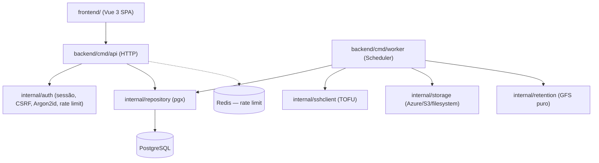
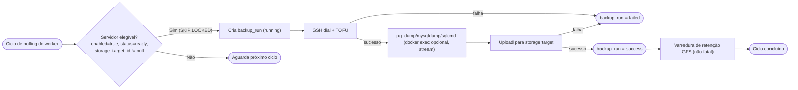
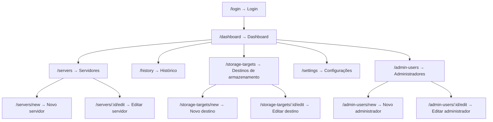
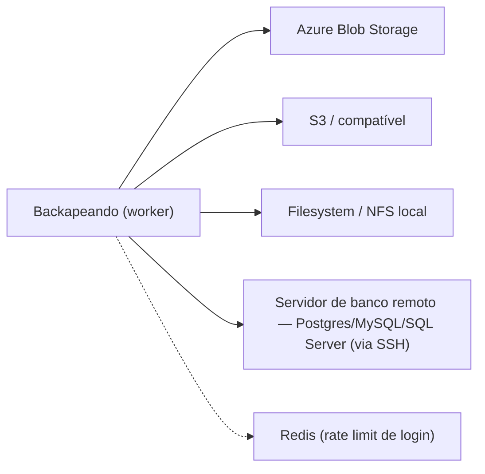

# Organograma — Backapeando

## Objetivo

Mapa visual vivo da lógica do projeto: como os módulos se relacionam, como o fluxo de negócio principal atravessa o sistema, como as telas se conectam e quais integrações externas existem.

Este documento é complementar a `docs/Arquitetura.md`, não um substituto. Sempre que a lógica do projeto mudar de um jeito que tornaria um destes diagramas enganoso, este arquivo precisa ser atualizado — ver `## Regras de alteração`.

## Visão geral de módulos

## Fluxo de negócio principal

Fluxo de um backup agendado, do disparo à retenção. `docs/RegrasNegocio.md` é a fonte da verdade textual das regras por trás de cada passo.

## Navegação de telas

Rota → tela, espelhando o índice de telas de `docs/RegrasNegocio.md`.

## Integrações externas

## Regras de alteração

Gatilho de atualização deste documento: módulo, camada, fluxo de negócio, tela, integração externa ou relação entre componentes mudou de forma que algum diagrama acima fique desatualizado.

Antes de alterar:

1. Consultar este arquivo.
2. Consultar `docs/Arquitetura.md` e `docs/RegrasNegocio.md` para confirmar se a mudança é real e não apenas de implementação interna.
3. Implementar a mudança.
4. Atualizar o(s) diagrama(s) afetado(s) — adicionar, remover ou renomear nós conforme a realidade nova.
5. Remover nó ou seção que deixou de existir; não deixar diagrama descrevendo algo que já foi removido do projeto.
6. Atualizar o histórico.

## Histórico

| Data | Área | Alteração | Motivo |
| --- | --- | --- | --- |
| 2026-09-15 | Todos os diagramas | Documento criado do zero a partir do código real, ausente antes desta tarefa | `/init-project --update` |
| 2026-09-15 | Navegação de telas | Adicionados nós `/admin-users`, `/admin-users/new`, `/admin-users/:id/edit` | CRUD de usuário administrador solicitado pelo usuário |
| 2026-09-15 | Fluxo de negócio principal, Integrações externas | Nó de dump generalizado de "docker exec pg_dump" para "pg_dump/mysqldump/sqlcmd (docker exec opcional)"; nó de integração generalizado de "Servidor PostgreSQL remoto" para "Servidor de banco remoto — Postgres/MySQL/SQL Server" | Suporte a MySQL/SQL Server e a bancos rodando direto no host, sem Docker |
